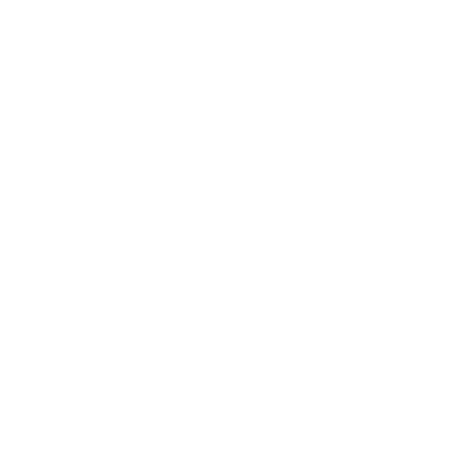
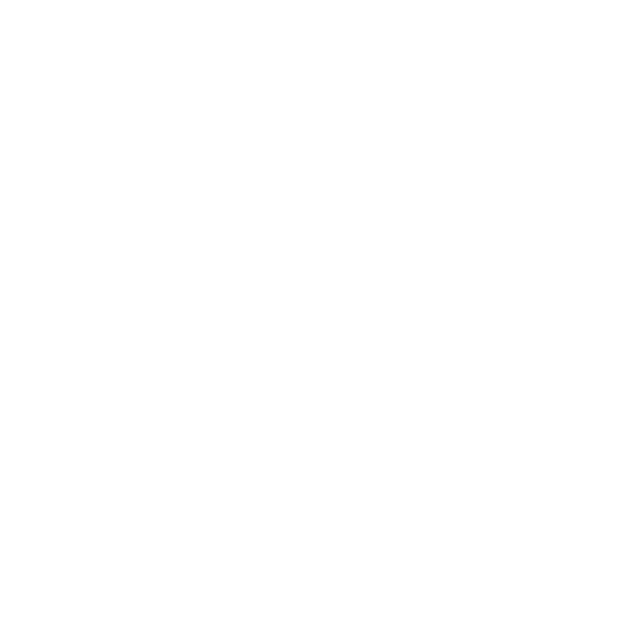
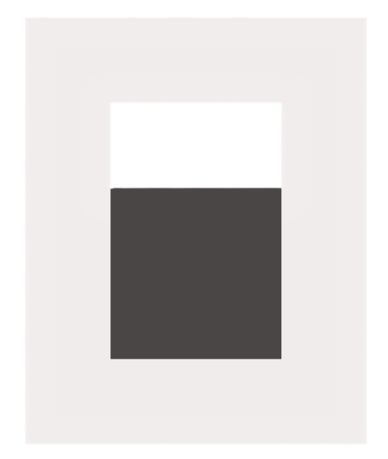

<p align="center">
  
</p>

<h1 align="center">AgentNotch</h1>

<p align="center">
  <strong>The quiet status strip for multi-agent developers.</strong><br/>
  <sub>One notch. Every agent. No tab-switching.</sub>
</p>

<p align="center">
  <a href="https://github.com/NastyRunner13/AgentNotch/actions/workflows/ci.yml"></a>
  <a href="https://github.com/NastyRunner13/AgentNotch/releases"></a>
  <a href="LICENSE"></a>
  <a href="https://github.com/NastyRunner13/AgentNotch/releases"></a>
  
  
</p>

<p align="center">
  <a href="#-supported-agents">Agents</a> · 
  <a href="#-features">Features</a> · 
  <a href="#%EF%B8%8F-quick-start">Quick Start</a> · 
  <a href="#-architecture">Architecture</a> · 
  <a href="#-production-builds">Builds</a> · 
  <a href="#-keyboard-shortcuts">Shortcuts</a> · 
  <a href="#-contributing">Contributing</a>
</p>

---

AgentNotch is a **cross-platform system-tray app** that presents a Mac-style notch at the top of your primary display. It watches local session files and process presence for your AI coding agents, distills them into glanceable status states — **idle**, **working**, **attention**, **error**, **question** — and keeps the full panel strictly on-demand.

> **Design philosophy:** *Calm · Precise · Unobtrusive.* The notch never pops open on its own. Sound and desktop notifications are earned by real agent need. The panel expands only when you ask.

## 🤖 Supported Agents

AgentNotch watches **6 AI coding agents** out of the box — all local, all private, zero cloud.

| Agent | Source Monitored | Detects |
| :--- | :--- | :--- |
|  **Claude Code** | `~/.claude/projects/**/*.jsonl` | Tool execution · user-input prompts · task completion |
|  **Codex** | `~/.codex/sessions/**/*.jsonl` | Command runs · prompt updates · rate limits |
|  **Cursor** | Process presence (`Cursor.exe` / `Cursor`) | Running / active state |
|  **Antigravity** | `~/.gemini/antigravity-ide/brain/**/transcript.jsonl` | Planning phases · subagent execution · task status |
|  **Grok Build** | `~/.grok/sessions/**/updates.jsonl` | Active tool names · command params · weekly credits |
|  **OpenCode** | `~/.local/share/opencode/opencode.db` (SQLite WAL, read-only) | Tool execution · step completion · model + token/cost |

> **Note:** OpenCode does not persist live permission requests to disk. Sessions report working/idle and activity only — approvals happen inside the OpenCode app.

## ✨ Features

### Ambient Notch UI
A thin status bar at the top center of your screen. It tucks itself into a slim **peek strip** 4 seconds after you stop interacting — even while agents run — and slides back when an agent finishes or needs you. Hover or click the peek strip to bring it back, hit **↑** to tuck instantly, or **📌** to pin it permanently.

### On-Demand Panel
Expands only when *you* ask: click the bar, the tray icon, the global hotkey, or a desktop notification. Agent events never pop it open or steal focus.

### Glanceable Counts
The collapsed bar carries the whole story at a glance:

| Strip State | Meaning |
| :--- | :--- |
| `● N running` | Agents actively working |
| `✓ N done` | Runs completed |
| Amber status line | An agent needs your attention |

### Claude Remote Approve
Allow or Deny Claude Code `PermissionRequest` prompts directly from the notch — no need to switch to the Claude terminal. Other agents focus their native app for approval.

<details>
<summary><strong>Setup instructions</strong></summary>

1. Open AgentNotch → **Settings**
2. Under **Claude remote approve**, click **Install hook**
3. Restart any open Claude Code sessions (hooks load at session start)
4. When Claude needs permission, the bar turns amber and a notification fires — click to open the panel, then press **Allow** (<kbd>Ctrl</kbd>+<kbd>Y</kbd>) or **Deny** (<kbd>Ctrl</kbd>+<kbd>N</kbd>)

**What install does:**
- Copies the bridge script to `~/.agent-notch/bin/claude-permission-bridge.js`
- Adds a `PermissionRequest` command hook in `~/.claude/settings.json` (existing hooks preserved)
- Pending requests and decisions live under `~/.agent-notch/permissions/`
- If the hook times out (~10 min) or AgentNotch is not running, Claude falls back to its normal dialog
</details>

### Live Session Cards
See the running model (`Grok 4.5`, `Gemini 1.5 Pro`, etc.), a live activity feed of recent commands and edited files, and current execution parameters — all on the session card.

### Usage Dashboard
A dedicated **Usage** tab with deep analytics — all computed locally:

- **Metrics:** Session time, tokens burned, estimated cost, session counts
- **Breakdowns:** Per-agent and per-model splits over Today / 7D / 30D / 90D
- **Charts:** Stacked daily burn chart (tokens or cost by agent), cumulative spend trajectory
- **Token mix:** Cache-read share breakdown
- **Derived stats:** Cost per session, average session length, model cost share
- **Backfill:** History reconstructed on first run by scanning local agent records

Daily buckets persist under `~/.agent-notch/usage-stats.json`; costs are list-price estimates unless the agent reports actual cost.

### Session Dispatch
Message any running agent session directly from the expanded notch — pick a live session and the prompt resumes that exact chat headlessly (no new windows), or start a new headless session for an agent in its most recent project directory.

### Conversation Insights
AI-powered conversation analysis that surfaces session patterns, agent behavior trends, and productivity signals across your agent interactions.

### Settings & History
Per-agent watcher toggles, notification sounds, desktop banners, autostart, and locally-archived session history.

## ⚡️ Quick Start

> **Prerequisites:** [Node.js](https://nodejs.org/) ≥ 20

```bash
# Clone the repository
git clone https://github.com/NastyRunner13/AgentNotch.git
cd AgentNotch

# Install dependencies
npm install

# Launch in development mode
npm run dev
```

Run the test suite (146 tests across 25 suites):
```bash
npm test
```

## 📦 Production Builds

Build distributable packages with [electron-builder](https://github.com/electron-userland/electron-builder):

| Command | Platform | Output |
| :--- | :--- | :--- |
| `npm run build:win` | Windows | NSIS installer (`.exe`) |
| `npm run build:mac` | macOS | Disk image (`.dmg`) — x64 + arm64 |
| `npm run build:linux` | Linux | AppImage (`.AppImage`) |

Automated release builds are triggered by pushing a `v*` tag — see the [release workflow](.github/workflows/release.yml).

## 🏗 Architecture

**Electron + Chokidar + Vanilla CSS/JS.** No frameworks, no bundlers — fast startup, low memory.

```
agent-notch/
├── src/
│   ├── main/                          # Electron main process
│   │   ├── index.js                   # Entry point, window management, IPC
│   │   ├── agent-manager.js           # Multi-agent lifecycle orchestration
│   │   ├── tray.js                    # OS tray icon, status colors, context menu
│   │   ├── store.js                   # Settings & session state (electron-store)
│   │   ├── logger.js                  # Quiet, file-based logging
│   │   ├── permission-bridge.js       # Claude PermissionRequest hook + IPC
│   │   ├── insights.js                # Conversation insights engine
│   │   ├── usage-limits.js            # Local resource tracker
│   │   ├── usage-stats.js             # Token/cost accumulation → daily buckets
│   │   ├── usage-backfill.js          # Full-history scan of agent session files
│   │   └── watchers/                  # Agent-specific file/process watchers
│   │       ├── base-watcher.js        #   Abstract watcher base class
│   │       ├── claude-watcher.js      #   Claude Code JSONL parser
│   │       ├── codex-watcher.js       #   Codex rollout log parser
│   │       ├── cursor-watcher.js      #   Cursor process tracker
│   │       ├── antigravity-watcher.js #   Antigravity transcript parser
│   │       ├── grok-watcher.js        #   Grok session updates tailer
│   │       ├── opencode-watcher.js    #   OpenCode SQLite WAL reader
│   │       └── session-utils.js       #   JSONL stream helpers
│   ├── preload/
│   │   └── index.js                   # contextBridge secure IPC
│   └── renderer/                      # UI (Notch, Panel, Settings)
│       ├── index.html                 # Shell HTML
│       ├── app.js                     # Renderer coordinator & IPC handlers
│       ├── components/
│       │   ├── session-card.js        #   Live session cards
│       │   ├── usage-view.js          #   Usage analytics dashboard
│       │   ├── insights-view.js       #   Conversation insights panel
│       │   ├── history-view.js        #   Session history browser
│       │   └── settings-panel.js      #   Settings & watcher toggles
│       └── styles/
│           ├── main.css               #   Design tokens & layout
│           └── components.css         #   Component styles
├── test/                              # Node.js native test runner
│   ├── analyzers.test.js              #   Agent log parser tests
│   ├── usage-stats.test.js            #   UsageTracker bucket/cost tests
│   ├── usage-backfill.test.js         #   History backfill tests
│   ├── usage-view.test.js             #   Usage view rendering tests
│   ├── insights.test.js               #   Insights engine tests
│   ├── insights-view.test.js          #   Insights view tests
│   ├── dispatch.test.js               #   Session dispatch tests
│   ├── permission-bridge.test.js      #   Permission bridge FS tests
│   └── markdown-table.test.js         #   Markdown table rendering tests
└── .github/workflows/
    ├── ci.yml                         # CI: Linux, macOS, Windows × Node 20, 22
    └── release.yml                    # Release: electron-builder → GitHub Releases
```

### Tech Stack

| Layer | Technology | Why |
| :--- | :--- | :--- |
| Runtime | Electron 36 | Cross-platform desktop, system tray, frameless window |
| File watching | Chokidar 4 | Efficient FS events for JSONL tailing |
| Persistence | electron-store | Simple JSON config, no external DB |
| UI | Vanilla JS + CSS | Zero-dependency renderer, instant startup |
| Testing | Node.js native `--test` | No test framework dependency |
| CI/CD | GitHub Actions | Matrix builds across 3 OS × 2 Node versions |
| Packaging | electron-builder | NSIS, DMG, AppImage outputs |

## ⌨️ Keyboard Shortcuts

| Shortcut | Action |
| :--- | :--- |
| <kbd>Ctrl</kbd>+<kbd>Shift</kbd>+<kbd>A</kbd> / <kbd>⌘</kbd><kbd>⇧</kbd><kbd>A</kbd> | Toggle notch panel |
| <kbd>Ctrl</kbd>+<kbd>Y</kbd> | Allow Claude permission request |
| <kbd>Ctrl</kbd>+<kbd>N</kbd> | Deny Claude permission request |

## 🔒 Privacy & Security

AgentNotch is **local-first and private by design.**

- ✅ **Zero telemetry** — no cloud dashboards, no accounts, no analytics
- ✅ **Read-only inspection** — agent logs are parsed directly, never modified
- ✅ **On-device only** — settings and history never leave your machine (`~/.agent-notch/`)
- ✅ **Secure IPC** — renderer communicates through Electron's `contextBridge` only

For responsible security disclosures, see [SECURITY.md](SECURITY.md).

## 🤝 Contributing

Contributions are welcome! Please read [CONTRIBUTING.md](CONTRIBUTING.md) for local setup, development guidelines, and conventional commit rules.

All community interactions are governed by our [Code of Conduct](CODE_OF_CONDUCT.md).

## 📋 Project Documentation

| Document | Purpose |
| :--- | :--- |
| [DESIGN.md](DESIGN.md) | Visual design system — colors, typography, components |
| [PRODUCT.md](PRODUCT.md) | Product philosophy, users, positioning, accessibility |
| [CONTRIBUTING.md](CONTRIBUTING.md) | Development setup & contribution guidelines |
| [CHANGELOG.md](CHANGELOG.md) | Release history |
| [SECURITY.md](SECURITY.md) | Security policy & vulnerability reporting |
| [CODE_OF_CONDUCT.md](CODE_OF_CONDUCT.md) | Community standards |

## 📄 License

[MIT](LICENSE) © AgentNotch Maintainers
